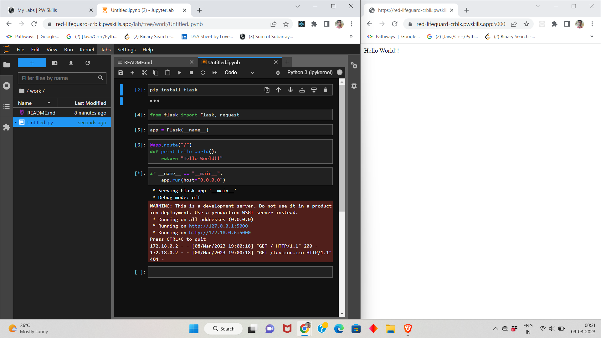
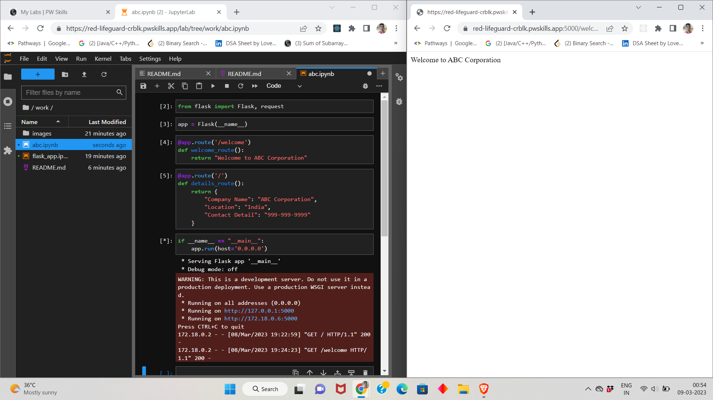
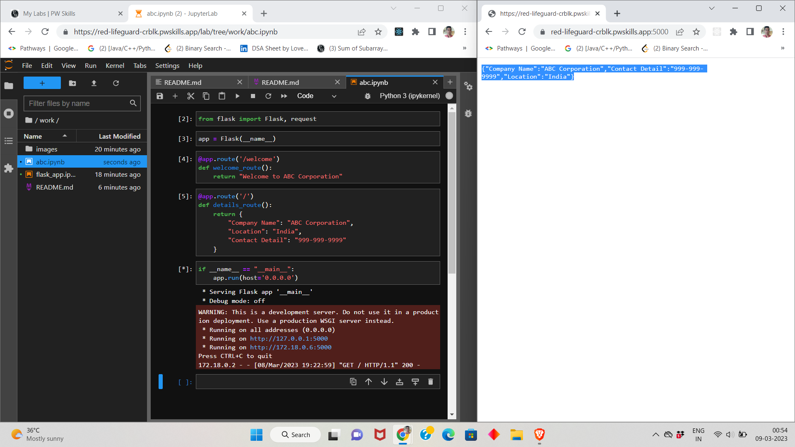
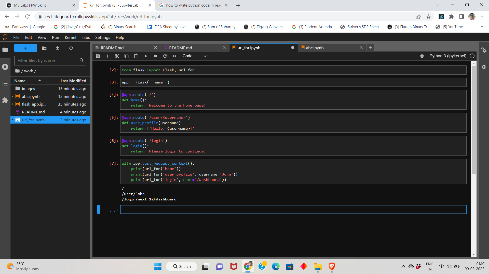

<!--  -->
# Q1. What is Flask Framework? What are the advantages of Flask Framework?
- Flask is a micro web application framework written in Python. It is designed to be simple and lightweight, allowing developers to quickly build web applications and APIs with minimal overhead. Flask provides tools and features for handling HTTP requests and responses, routing URLs, templating, database integration, and more.

## Advantages
- <h6>Simplicity:</h6> Flask is designed to be simple and easy to use, with a minimalistic core that can be extended with third-party libraries as needed.
- <h6>Flexibility:</h6> Flask is highly customizable, allowing developers to choose the components and libraries they need for their specific application.
- <h6>Lightweight:</h6> Flask has a small footprint and minimal overhead, making it a good choice for small to medium-sized applications.
- <h6>Easy to Learn:</h6> Flask has a low barrier to entry, making it a good choice for beginners who are just getting started with web development.
- <h6>Large Community:</h6> Flask has a large and active community of developers, which means there are many resources available for learning, troubleshooting, and getting help with any issues.
- <h6>Python Integration:</h6> Since Flask is written in Python, it integrates well with other Python libraries and tools, making it easy to build complex applications with multiple components.

# Q2. Create a simple Flask application to display ‘Hello World!!’. Attach the screenshot of the output in Jupyter Notebook.


# Q3. What is App routing in Flask? Why do we use app routes?
- In Flask, app routing refers to the process of mapping URL paths to specific functions or views that handle requests to those paths. In other words, app routing determines which function should be executed when a user navigates to a specific URL in the application.

- App routes are used in Flask to define the URL paths that users can access within the application. By defining routes, developers can specify which functions or views should be executed when users navigate to those paths.

# Q4. Create a “/welcome” route to display the welcome message “Welcome to ABC Corporation” and a “/” route to show the following details: 
```
Company Name: ABC Corporation
Location: India
Contact Detail: 999-999-9999
```



# Q5. What function is used in Flask for URL Building? Write a Python code to demonstrate the working of the url_for() function.
- In Flask, the `url_for()` function is used for URL building. It generates a URL to the specified endpoint with the given arguments.
```python
from flask import Flask, url_for

app = Flask(__name__)

@app.route('/')
def home():
    return 'Welcome to the home page!'

@app.route('/user/<username>')
def user_profile(username):
    return f'Hello, {username}!'

@app.route('/login')
def login():
    return 'Please login to continue.'

with app.test_request_context():
    print(url_for('home')) # Output: "/"
    print(url_for('user_profile', username='John'))
    print(url_for('login', next='/dashboard'))
```
